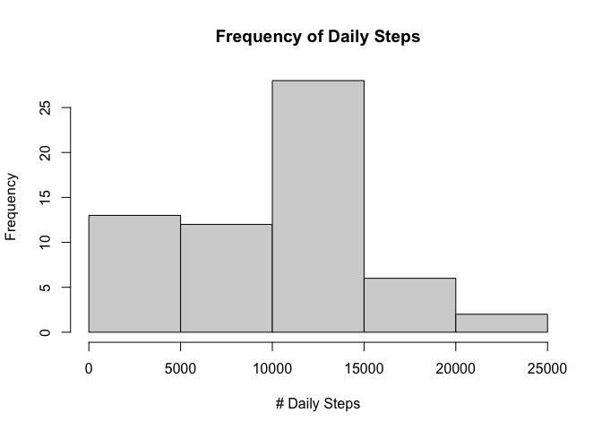
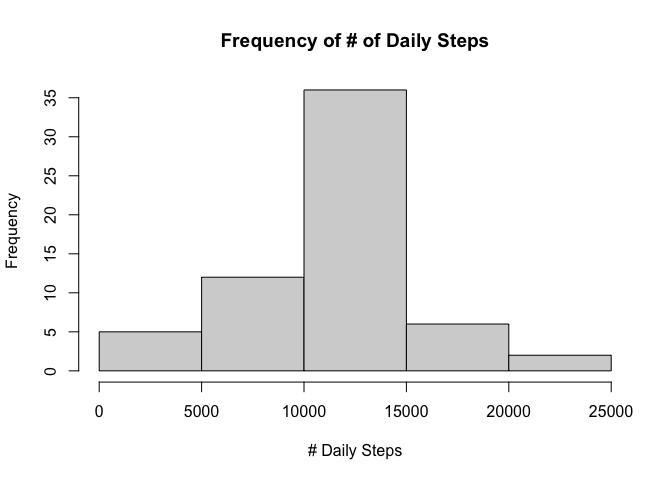

###  Assuming 'activity.csv' is in working directory load and process the data.

```r
     activity <- read.csv("activity.csv")
```
     
###  Create initial dataframes
 - dailysteps - total amount of steps per day
 - intervalsteps - average amount of steps per time interval

```r
     dailysteps <- aggregate(list(steps=activity$steps), 
          by = list(date = activity$date), 
          FUN = "sum", 
          na.rm = TRUE)
     
     intervalsteps <- aggregate(list(steps=activity$steps), 
          by = list(interval = activity$interval), 
          FUN = "mean", 
          na.rm = TRUE)
```
 
## What are the mean and median number of steps taken per day?
### Mean number of steps per day

```r
     mean <- mean(dailysteps$steps, na.rm=TRUE)
     mean
```

```
## [1] 9354.23
```
### Median number of steps per day

```r
     median <- median(dailysteps$steps, na.rm=TRUE)
     median
```

```
## [1] 10395
```
### Histogram of number of steps per day

```r
     hist(dailysteps$steps, 
          xlab = "# Daily Steps", 
          main="Frequency of Daily Steps")
```

<!-- -->

## What is the average daily activity pattern?

```r
     plot(intervalsteps$interval, intervalsteps$steps, 
          type="l", 
          xlab="Minute intervals", 
          ylab="Steps (mean)")
```

<!-- -->

### Which 5-minute interval, on average, contains the maximum number of steps?

```r
     intervalsteps[which.max(intervalsteps[,2]),]
```

```
##     interval    steps
## 104      835 206.1698
```

## Inputing missing values

### How many NAs are in the original dataset?

```r
     sapply(activity, function(x) sum(is.na(x)))
```

```
##    steps     date interval 
##     2304        0        0
```

### Create a copy of the original data set and replace NAs with the average interval steps previously calculated
 

```r
     newactivity <- activity
     newactivity[is.na(newactivity)] = intervalsteps$step
```

### Create an aggregate of the new dataset, then calculate new mean, median and histogram.

```r
     newsteps <- aggregate(list(steps=newactivity$steps), 
          by = list(date = newactivity$date), 
          FUN = "sum", 
          na.rm=TRUE)
```

### Original and new mean number of steps per day.

```r
     mean
```

```
## [1] 9354.23
```

```r
     newmean <- mean(newsteps$steps, na.rm=TRUE)
     newmean
```

```
## [1] 10766.19
```

### Original and new median number of steps per day.

```r
     median
```

```
## [1] 10395
```

```r
     newmedian <- median(newsteps$steps, na.rm=TRUE)
     newmedian
```

```
## [1] 10766.19
```

### Using updated data generate a histogram of the number of steps per day.

```r
     hist(newsteps$steps, xlab = "# Daily Steps", 
          main="Frequency of # of Daily Steps")
```

<!-- -->

 - New mean and median are higher than original.
 - New histogram is more bell curved.
 - Both of these results are due to replacing the NAs with the average steps per interval.  
 
## Are there differences in activity patterns between weekdays and weekends?
 - Use updated copy of the original activity dataset
 - Add weekday column that contains the day of the week for that row's date


```r
     newactivity$weekday <- weekdays(as.Date(as.character(newactivity$date)))
```

 - Add weekend column that contains "weekday"/"weekend" factor variable

```r
      newactivity$weekend <- ifelse((newactivity$weekday=="Saturday"|
            newactivity$weekday=="Sunday"),"weekend", "weekday")
      newactivity$weekend <- as.factor(newactivity$weekend)
```

 - Create new aggregate of interval steps on the weekend factor column and interval

```r
      newintervalsteps <- aggregate(list(steps=newactivity$steps), 
            by = list(weekend = newactivity$weekend, interval = newactivity$interval), 
            FUN = "mean", 
            na.rm=TRUE)
```

### Plot out interval steps by weekend and weekday
 - It seems like there are more steps in the morning on weekdays 
 - Step distribution was more even over the weekends,.


```r
     library(lattice)
     xyplot(newintervalsteps$steps ~ newintervalsteps$interval | newintervalsteps$weekend, 
            layout = c(1, 2), 
            type="l")
```

<!-- -->
